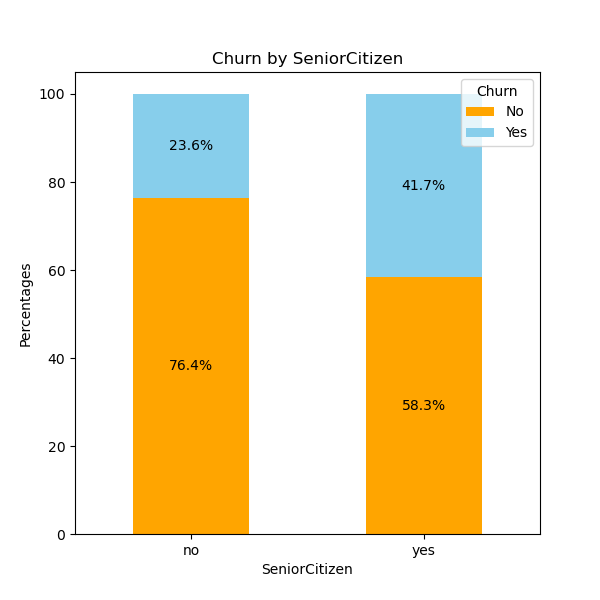
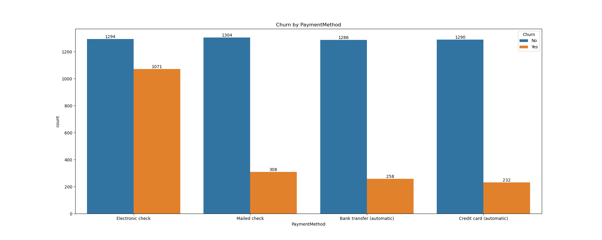
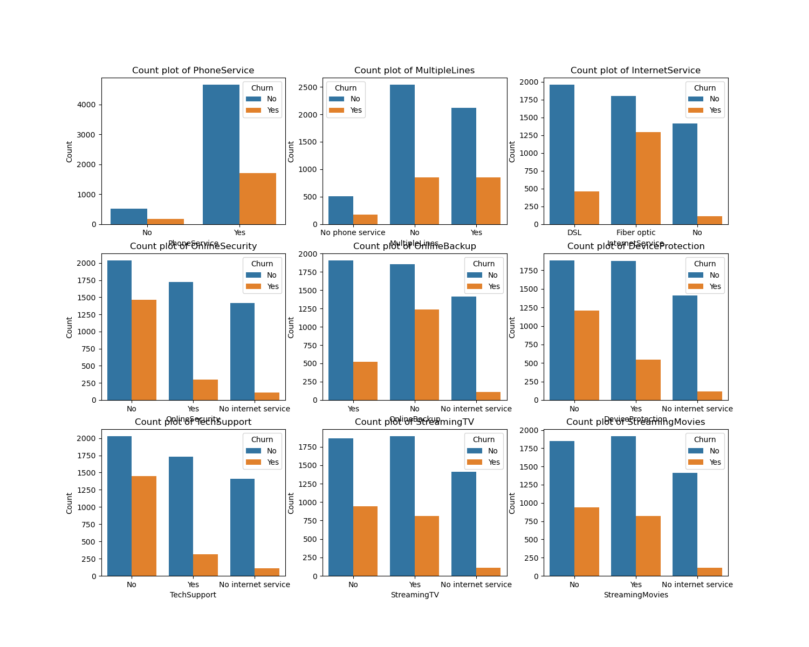
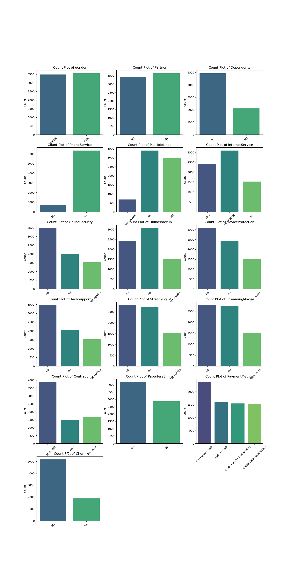
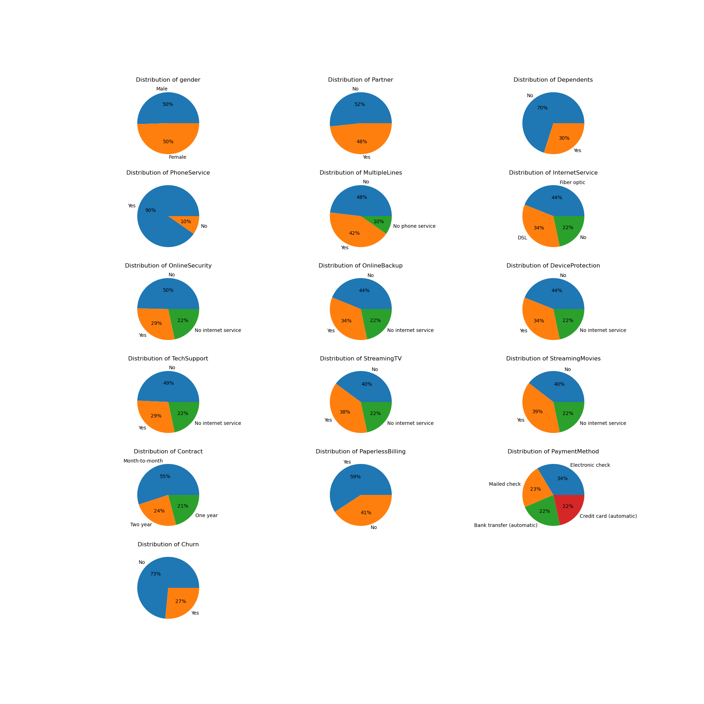

# 📊 **Customer Churn Analysis**  
<br>  

## 🌟 **Project Overview**  
Customer churn is a major concern for businesses as retaining customers is more cost-effective than acquiring new ones. This project dives into customer data to analyze:  
- **Who churns?**  
- **Why do they churn?**  
- **How can businesses reduce churn?**  
<br>  
Through powerful visualizations and data-driven insights, this analysis equips stakeholders with actionable strategies to enhance customer retention.  
<br>  

## 🎯 **Objectives**  
- Explore and understand the patterns in churn behavior.  
- Identify key factors influencing churn, such as contract type, tenure, and payment methods.  
- Provide insights to design targeted retention strategies.  
<br>  

## 📂 **Key Files in the Repository**  
| **File Name**            | **Description**                                                   |  
|--------------------------|-------------------------------------------------------------------|  
| `Customer_Churn.csv`     | The dataset used for the analysis.                               |  
| `Churn_Analysis.ipynb`   | Jupyter Notebook containing the full analysis and visualizations.|  
| `README.md`              | Project overview and usage instructions.                         |  
<br>  

---

## 🔍 **Exploratory Insights**  
1️⃣ **Churn Distribution**  
- **Churn Rate:** 26.54% of customers have churned.  
- 📊 A balanced analysis of churned and non-churned customers is provided for better understanding.  
<br>  

2️⃣ **Demographics and Churn**  
- **Senior Citizens:** ~42% churned compared to ~24% for non-senior citizens.  
- **Gender:** No significant difference (~27% male vs. ~26% female).  
<br>  

3️⃣ **Behavioral Insights**  
- **Tenure Impact:**  
  - Customers with short tenures (1–2 months) churn ~60%.  
  - Long tenures (>50 months) churn only ~10%.  
- **Contract Types:**  
  - Month-to-month: 42% churn  
  - One-year: 11% churn  
  - Two-year: 3% churn  
- **Payment Methods:**  
  - Electronic Checks: ~46% churn  
  - Other methods: ~20–23% churn  
<br>  

4️⃣ **Services and Churn**  
- **Internet Service:**  
  - Fiber Optic: 41% churn  
  - DSL: 19% churn  
- **Value-Added Services:**  
  - Customers without **Online Security** or **Tech Support** churn at ~40–42%, compared to ~20% for those who have these services.  
<br>  

---

## 📊 **Visualizations Included**  
### **Churn by Senior Citizen**  
  
<br>  

### **Churn by Contract Type**  
  
<br>  

### **Payment Method Impact**  
  
<br>  

### **Services Columns**  
  
<br>  

### **All_Categorical_countplot**  
  
<br>  

### **All_Categorical_Pie**  
  
<br>  


---

## 🛠️ **Technologies Used**  
- **Programming Language:** Python  
- **Libraries:**  
  - Pandas  
  - Matplotlib  
  - Seaborn  
<br>  

---

## 🚀 **Getting Started**  
### **Prerequisites**  
Ensure you have the following installed:  
- Python 3.x  
- Jupyter Notebook  
- Required libraries:  
  ```bash
  pip install pandas matplotlib seaborn
  ```  
<br>  

### **Installation**  
1. **Clone the repository:**  
   ```bash
   git clone https://github.com/yourusername/CustomerChurnAnalysis.git
   ```  
2. **Navigate to the project directory:**  
   ```bash
   cd CustomerChurnAnalysis
   ```  
3. **Open the Jupyter Notebook:**  
   ```bash
   jupyter notebook Churn_Analysis.ipynb
   ```  
<br>  

---

## ✨ **Future Work**  
- Add predictive modeling to forecast churn.  
- Automate insights generation using dashboards.  
- Incorporate advanced visualizations with Plotly or Dash.  
<br>  

---

## 📞 **Contact**  
**Abhinish Tiwari**  
📧 [your.email@example.com](abhinishtiwari02.com)  
🔗 [GitHub Profile](https://github.com/abhinishtiwari)  

